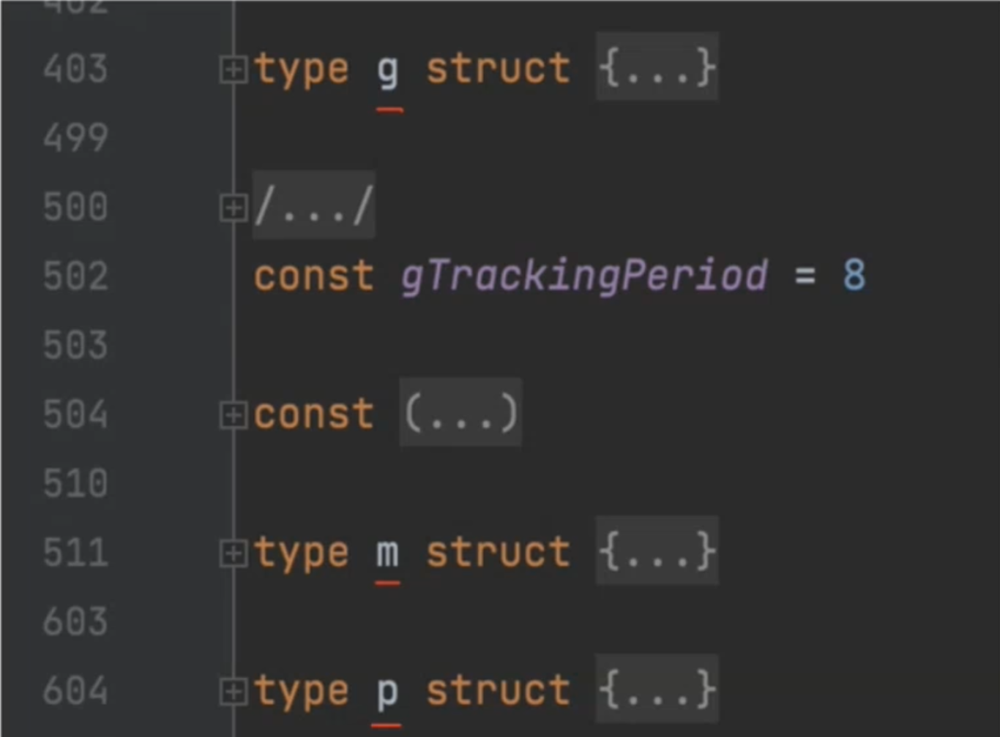
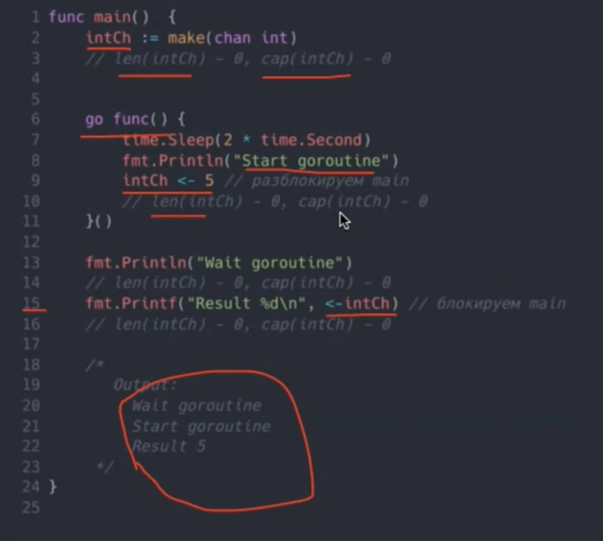
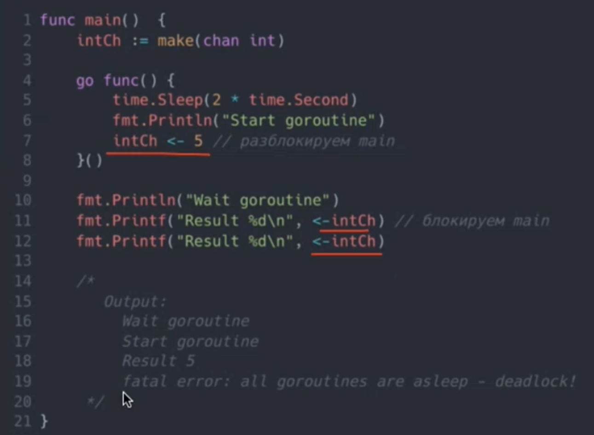
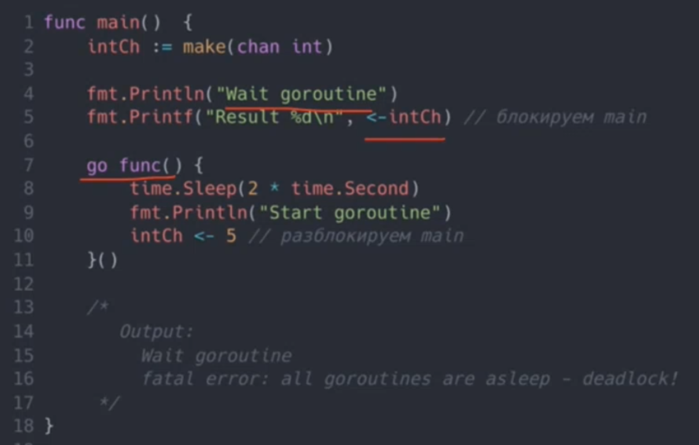
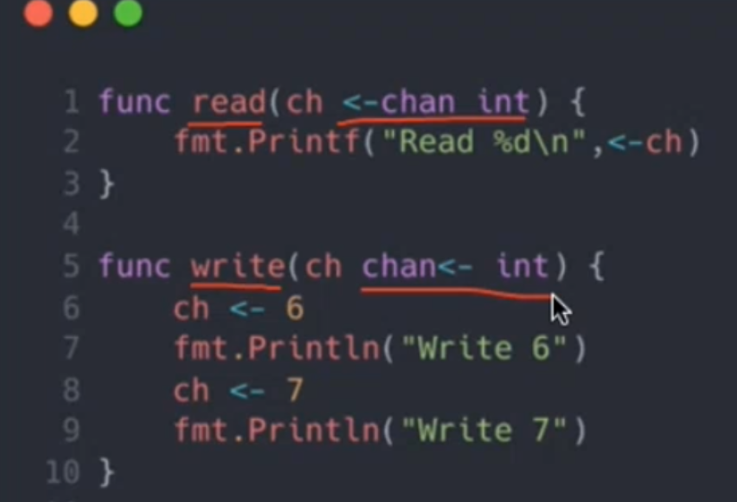
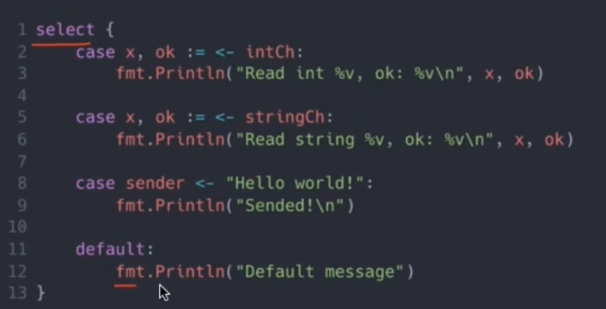
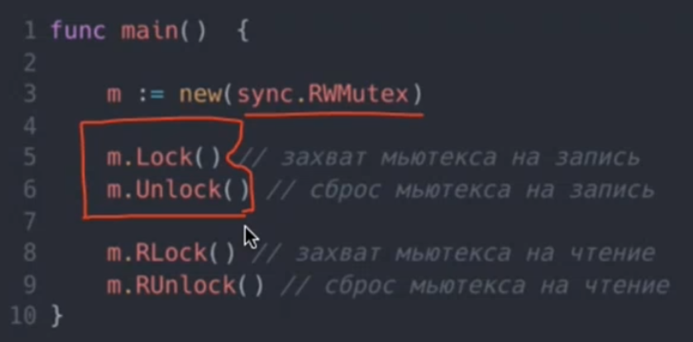
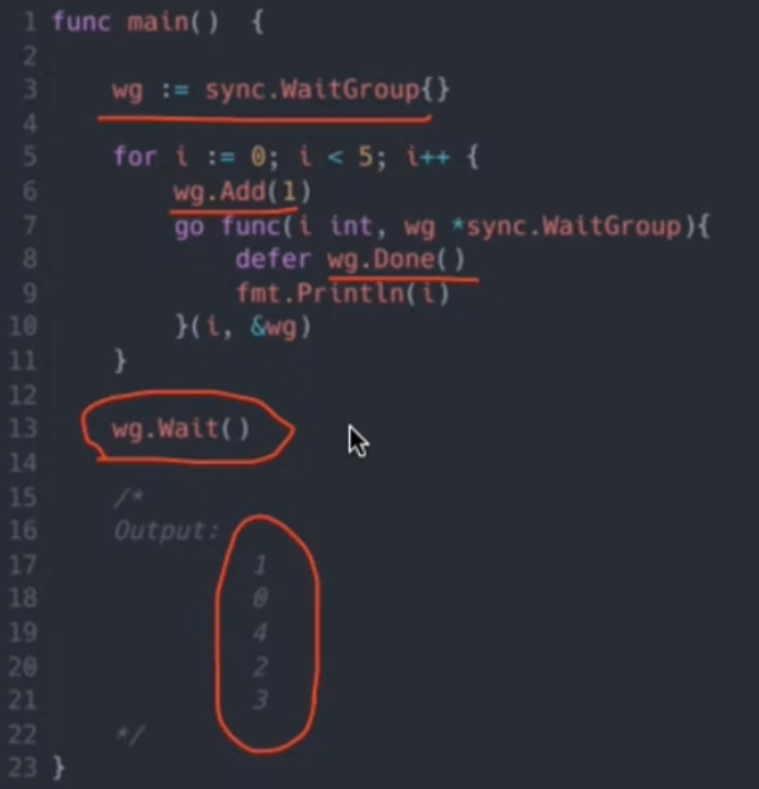
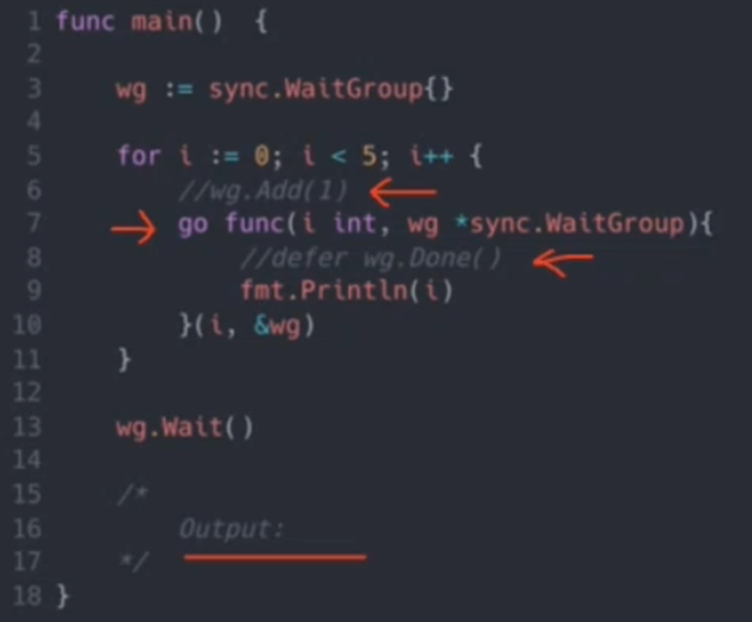
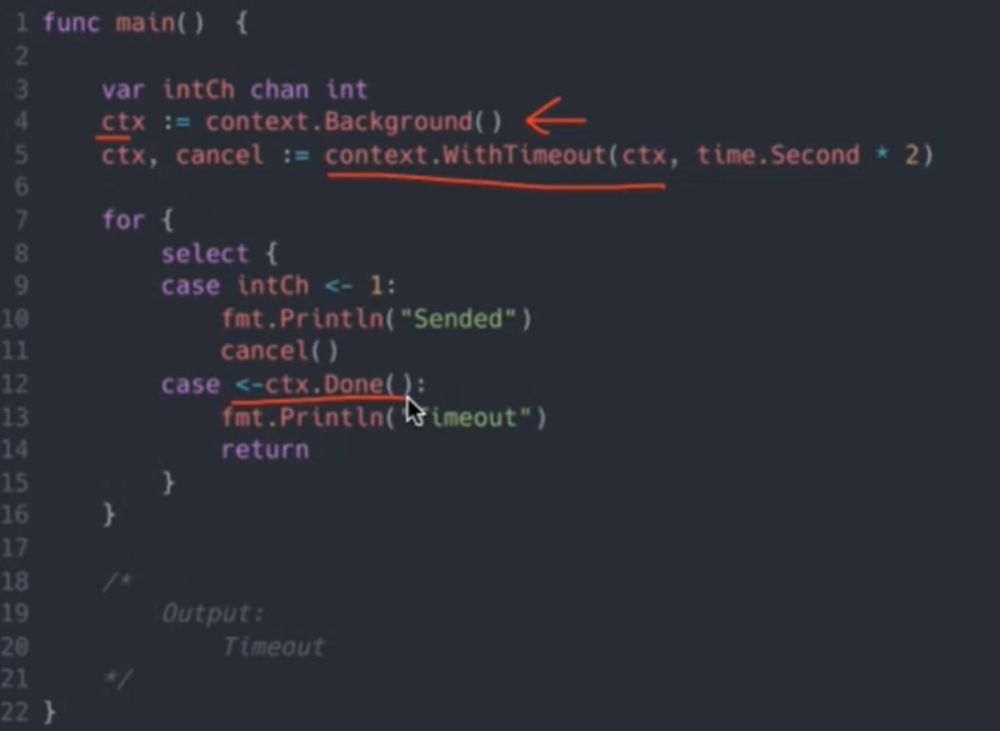

# 1\. Concurrency vs Parallelism

## Определение

**параллельность** \- несколько потоков одновременно выполняются

**Конкурентность** \- управление передается то одному, то другому

## Проблемы

- непредсказуемость
- синхронизация
- багфикс
- общие хранилища

# 2\. Процессы, потоки, горутины

## Процесс

> \- это отдельная единица исполнения.

### Особенности:

- раздельные ресурсы
- раздельная память
- раздельный стек

ОС и процессы

## до ос:

- нет многозадачности
- нет нескольких процессов =\> нет проблем
- программисты спят спокойно

### после ос:

- многозадачность
- два и более процесса
- программистам не до сна

## Поток

> \- это набор операций, выполняемых независимо в рамках процесса.

### Особенности:

- общие ресурсы
- общая память
- раздельный стек

## Горутины

> \- это легковесный поток внутри потока ОС.

### Особенности:

- общие ресурсы
    
- общая память
    
- общий системный стек
    

### стек:

- горутина \- структура, которая выполняет переданную функцию
    
- самый тяжелый элемент структуры \- *stack*
    
- по умолчанию выделяется 2КБ
    
- в процессе стек может измениться, если потребуется
    
- у стека есть максимальный размер \- 1ГБ для 64бит и 250Кб для 32бит
    

## Пример горутины

```go
func testFunc() int{
    fmt.Println("2 + 2")
}

func main() {
    go testFunc()
    go func() {
        fmt.Println("1 + 1")
    }()
}
```

# 3\. Runtime и планировщик Go

## Runtime

\*\* *m* \*\*\- реальный поток ОС, создается по числу виртуальных процессов

***p*** \- реальный процессор, представляет каждое виртуальное ядро

***g*** \- горутина, создается при необзодимости, как минимум, одна для *main*

**

## Go Scheduler

управление *g* осуществляется шедулером Go, а не ОС

Переключение **может быть **выполнено, если:

- запускается новая горутина
- собирается мусор
- запускается синхронизация
- происходит системный вызов
- происходит аллокация стека

# Пример



# 4\. Каналы

> \- механизм взаимодействия между горутинами

содержит информацию:

- размер буфера
- закрыт/открыт
- свзанные горутины
- мьютекс
- и тд


## Небуфферизированные каналы



## Deadlock

 

## Буфферизированные каналы


## Запись в закрытый канал

- записывать не можем
- читать можем


## Передача в функцию



## Select



# 5\. Примитивы синхронизации

## Mutex, RWMutex

> блокировка для определения возможности доступа к выполнению действия



## WaitGroup

> блокировка по счетчику

 

## Atomic

- все атомии реализуют `Load`, `Store`, `Swap`. `CompareAndSwap`
- базовые целочисленные атомики также реализуют `Add`
- `Swap(addr *T, new T) T` \- по адресу пишет `new`, возвращает старое значение `addr*`
- `CompareAndSwap(addr *T, old, new T) bool` \- если значение по ссылке равно `old`, то пишет туда `new` и возвращает `true`, иначе `false`

## Context

> передача метаданных по цепочке вызовов и обработка завершения

 

## Дополнительно из sync

- Cond - ожидает срабатывания условия
- Map - потокобезопасный словарь
- Once - обеспенчивает выполнение функции не более одного раза
- Pool - пул ресурсов для работы

# Итоги

1.  Конкурентность != параллелизм
2.  процесс -> поток -\> горутина
3.  планировщик Go умен и серьезен
4.  каналы \- мощный ниструмент комуникации
5.  примитивы синхронизации \- это просто и очень нужно