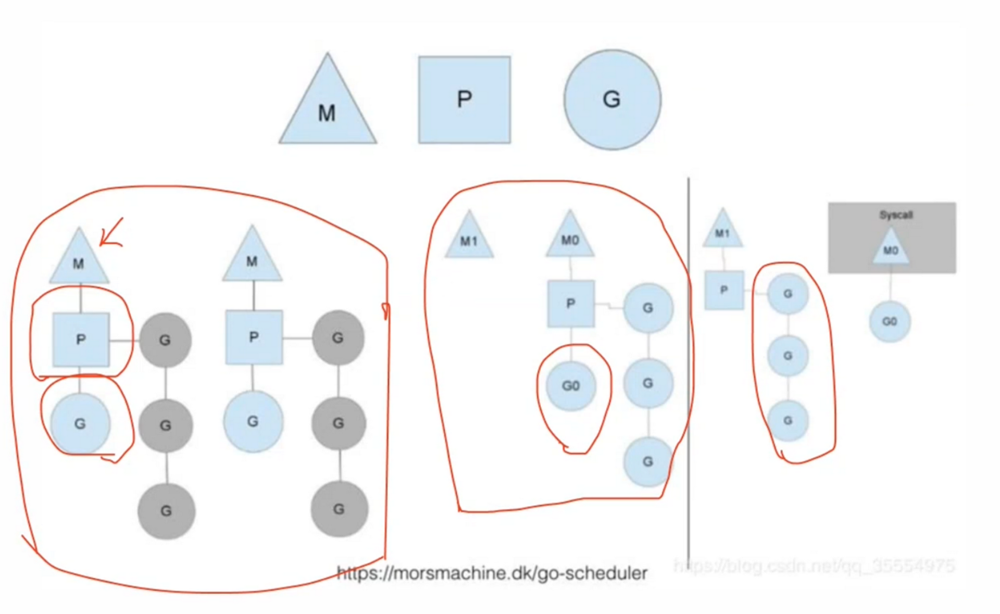
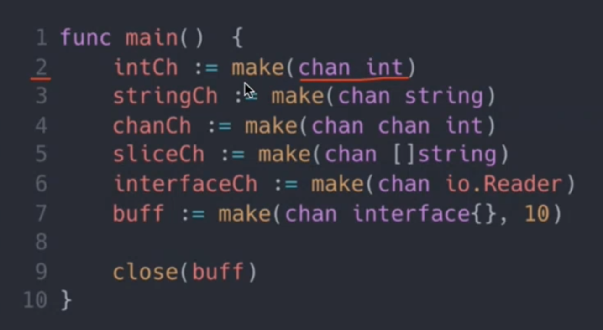
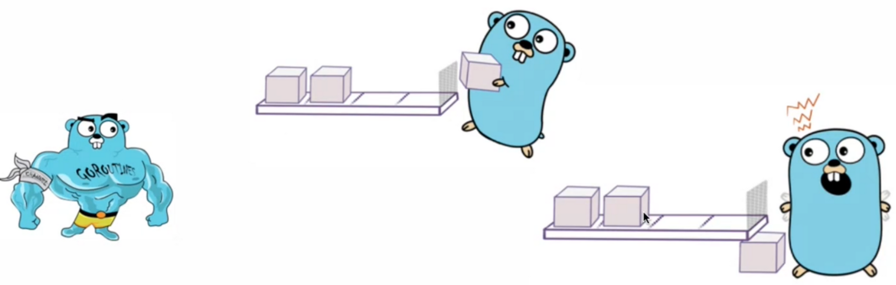

---

tags:
  - go
  - операционные_системы
---

# 1. Concurrency vs Parallelism

## Определение

**параллельность** - несколько потоков одновременно выполняются

**Конкурентность** - управление передается то одному, то другому

## Проблемы

- непредсказуемость
- синхронизация
- багфикс
- общие хранилища

# 2. Процессы, потоки, горутины

## Процесс
> Процесс - это отдельная единица исполнения.

### Особенности:

- раздельные ресурсы
- раздельная память
- раздельный стек

## до ос:

- нет многозадачности
- нет нескольких процессов =\> нет проблем
- программисты спят спокойно

### после ос:

- многозадачность
- два и более процесса
- программистам не до сна

## Поток

> Поток - это набор операций, выполняемых независимо в рамках процесса.

### Особенности:

- общие ресурсы
- общая память
- раздельный стек

## Горутины

> Горутины - это легковесный поток внутри потока ОС.

### Особенности:

- общие ресурсы
- общая память
- общий системный стек


### стек:

- горутина 
- структура, которая выполняет переданную функцию
- самый тяжелый элемент структуры 
- *stack*
- по умолчанию выделяется 2КБ
- в процессе стек может измениться, если потребуется
- у стека есть максимальный размер \- 1ГБ для 64бит и 250Кб для 32бит

## Пример горутины

```go
func testFunc() int{
    fmt.Println("2 + 2")
}

func main() {
    go testFunc()
    go func() {
        fmt.Println("1 + 1")
    }()
}
```

# 3. Runtime и планировщик Go

## Runtime

 ***m***- реальный поток ОС, создается по числу виртуальных процессов

***p*** - реальный процессор, представляет каждое виртуальное ядро

***g*** - горутина, создается при необзодимости, как минимум, одна для *main*



## Go Scheduler

управление ***g*** осуществляется шедулером Go, а не ОС

Переключение **может быть** выполнено, если:

- запускается новая горутина
- собирается мусор
- запускается синхронизация
- происходит системный вызов
- происходит аллокация стека

# 4. Каналы

> Каналы - механизм взаимодействия между горутинами

содержит информацию:

- размер буфера
- закрыт/открыт
- свзанные горутины
- мьютекс
- и тд



## Небуфферизированные каналы

```go
func main() {
	intCh := make(chan int)
	intBuffCh := make(chan int, 10)
}
```

## Deadlock


```go
func main() {
	intCh := make(chan int)
	
	go func() {
		time.Sleep(2 * time.Second)
		fmt.Println("Start goroutine")
		intCh <- 5 // pasbnokupyem main
	}()
	
	fmt.Println( “Wait goroutine")
	fmt.Printf( "Result %d\n", <-intCh) // Groxupyem main
	fmt.Printf("Result %d\n", <-intCh)
	
	 
	
	/*
	Output:
		Wait goroutine
		Start goroutine
		Result 5
		fatal error: all goroutines are asleep - deadlock!
	*/
}

```
## Буфферизированные каналы


## Запись в закрытый канал

- записывать не можем
- читать можем



## Передача в функцию

```go
func read(ch <-chan int) {
	fmt.Printf( "Read %d\n",<-ch)
}

func write(ch chan<- int) {
	ch <- 6
	fmt.Println( "Write 6")
	ch <- 7
	fmt.Println( "Write 7")
}

```

## Select


```go
select {
	case x, ok := <- intCh:
		fmt.Printin("Read int %v, ok: %v\n", x, ok)
	
	case x, ok := <- stringCh:
		fmt.Println( "Read string %v, ok: %v\n", x, ok)
	
	case sender <- "Hello world!":
		fmt.Printin("“Sended!\n")
	
	default:
		fmt.Printin( "Default message")
}

```
# 5. Примитивы синхронизации

## Mutex, RWMutex

> блокировка для определения возможности доступа к выполнению действия

```go
func main() {
	
	m := new(sync.RWMutex)
	
	m.Lock()
	m.Unlock()
	
	m.RLock()
	m.RUnlock()
}

```

## WaitGroup

> блокировка по счетчику

```go
func main() {
	wg := sync.WaitGroup{}

	for i := 0; i < 5; i++ {
		wg.Add(1)
		go func(i int, wg *sync.WaitGroup) {
			defer wg.Done()
			fmt.Println(i)
		}(i, &wg)
	}

	wg.Wait()
}
```

## Atomic

- все атомии реализуют `Load`, `Store`, `Swap`. `CompareAndSwap`
- базовые целочисленные атомики также реализуют `Add`
- `Swap(addr *T, new T) T` \- по адресу пишет `new`, возвращает старое значение `addr*`
- `CompareAndSwap(addr *T, old, new T) bool` \- если значение по ссылке равно `old`, то пишет туда `new` и возвращает `true`, иначе `false`

## Context

> передача метаданных по цепочке вызовов и обработка завершения


```go
func main() {
	
	var intCh chan int
	ctx := context.Background()
	ctx, cancel := context.WithTimeout(ctx, time.Second * 2)
	
	
	for {
		select {
		case intCh <- 1:
			fmt.Printin("Sended")
			cancel()
		case <-ctx.Done()
			fmt.Printin("timeout”)
			return
		}
	}
}

```
## Дополнительно из sync

- Cond - ожидает срабатывания условия
- Map - потокобезопасный словарь
- Once - обеспенчивает выполнение функции не более одного раза
- Pool - пул ресурсов для работы

# Итоги

1.  Конкурентность != параллелизм
2.  процесс -> поток -\> горутина
3.  планировщик Go умен и серьезен
4.  каналы \- мощный ниструмент комуникации
5.  примитивы синхронизации \- это просто и очень нужно