# 1\. Зачем нужны паттерны?

## Вопросы

- Как лучше организовать конкурентный код?
- Поймет ли мою затею другой разработчик?
- Легко ли дорабатывать мой код?
- Как решают такую задачу другие?
- Насколько сложная моя задача?

## Паттерны

> шаблонные конструкции, решающие проблемы проектирования в рамках часто возникающего контекста

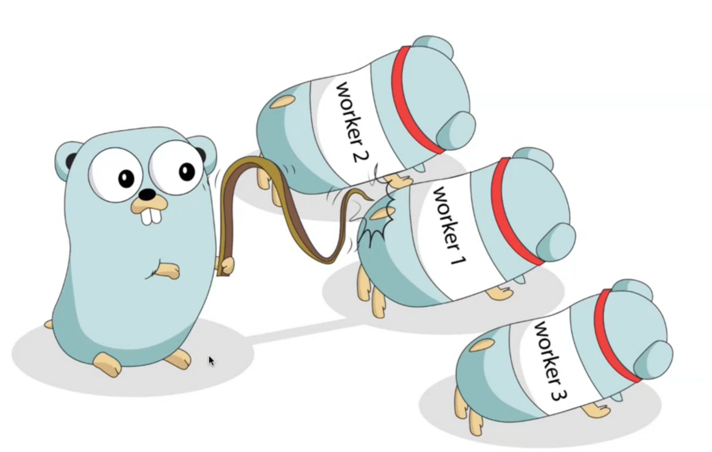

*worker* \- горутина, выполняющая полезную работу

\*job - \*данные, которые горутина обрабатывает

# 2\. Pipelines

## Проблема

Необходимо вывести задачи для исполнителя.

- Как организовать несколько этапов обработки задач перед выводом?
- Как помогут горутины на каждом этапе?
- Как не потерять данные в процессе?

## Пайплайны

последовательность этапов, соединенных каналами и использующих горутины для решения задач.

На каждом этапе горутины:

- получают значения черещ входящие каналы
- выполняют функцию над данными
- отправляют значения через исходящие каналы

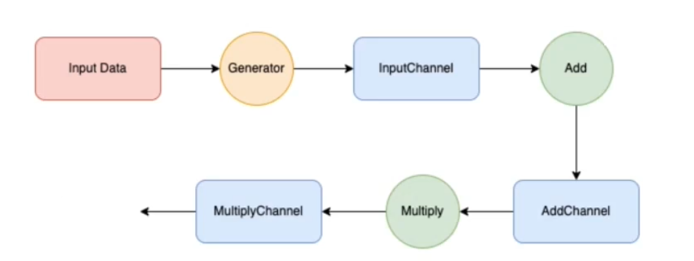 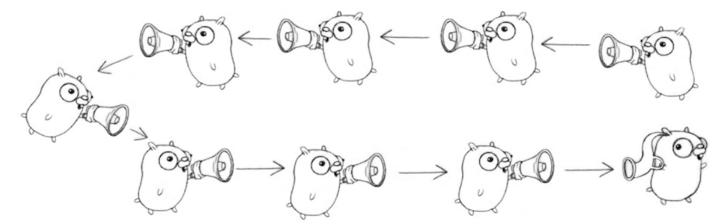

## Пример

```go
package main

import "fmt"

type Task struct {
    Id    int
    Index int
}

func build(in []int) <-chan Task {
    out := make(chan Task)
    go func() {
        for _, n := range in {
            out <- Task{
                Id: n,
            }
        }
        close(out)
    }()

    return out
}

func makeIndex(id int) int {
    return id - 10
}

func fillIndex(in <-chan Task) <-chan Task {
    out := make(chan Task)
    go func() {
        for task := range in {
            task.Index = makeIndex(task.Id)
            out <- task
        }
        close(out)
    }()

    return out
}

func main() {
    in := build([]int{1, 2, 3})
    out := fillIndex(in)

    for task := range out {
        fmt.Println(task)
    }
}
```

## Когда использовать?

- Есть последовательные этапы
- Есть вероятность появления нового жтапа
- Есть потребность обрабатывать входные данные горутинами

# 3\. Fan-in/fan-out

## проблемы

- как распределить один канал на несколько функций?
- как обьединить полученные каналы вывода в один?
- как делать все вышеперечисленное вместе?

> ***Fan-in*** - функция принимает несколько  каналов на вход и выдает один (вдувание)
> 
> ***Fan-out*** \- несколько функций читают из одного и того же канала (раздувание)

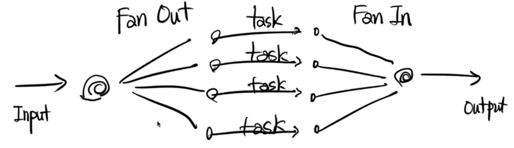 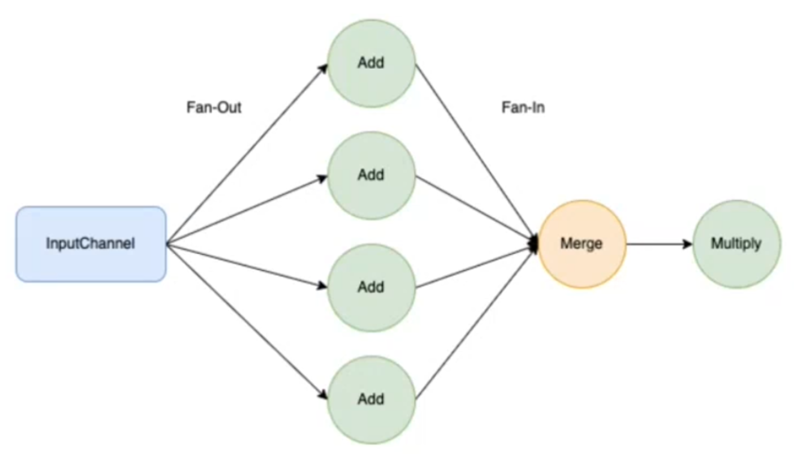

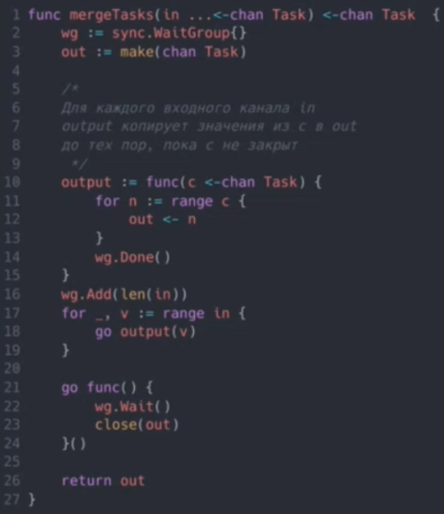  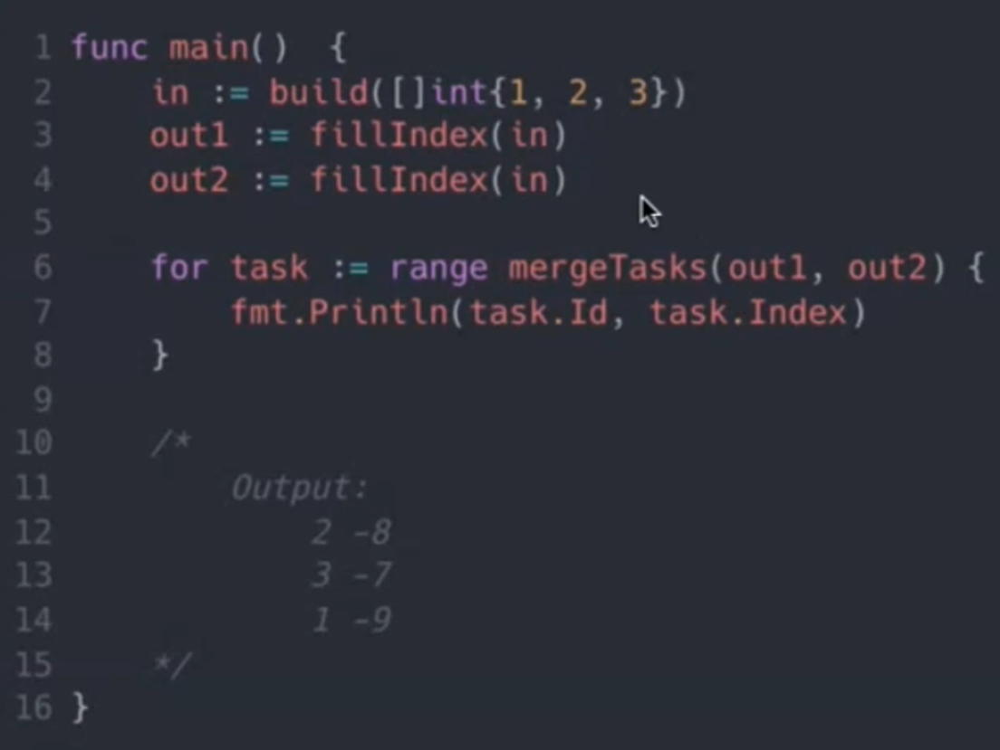

## Когда использовать?

- Есть потребность распределять работу с данными из одного канала по нескольким горутнам
- Важно обьединять результаты из разных каналов вывода
- Есть потребность использовать горутины

# 4\. Worker Pool

## Проблемы

- Как быть, когда нет разных этапов обработки?
- Как управлять параллельной обработкой?
- Как избавиться от дублирования вызовов пайплайна в клиентском коде?

## Пул воркеров

> паттерн, позволяющий параллельно обработать большое количество *задач (jobs)* несколькими *работниками (workers) *

- Позволяет управлять количеством воркеров
- Позволяет обрабатывать параллельно воркерами большое количество задач

**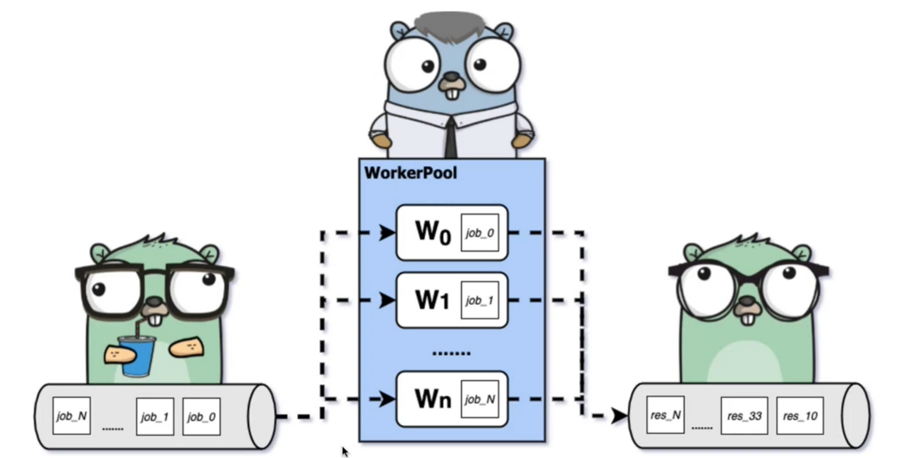**

## Без Worker Pool

**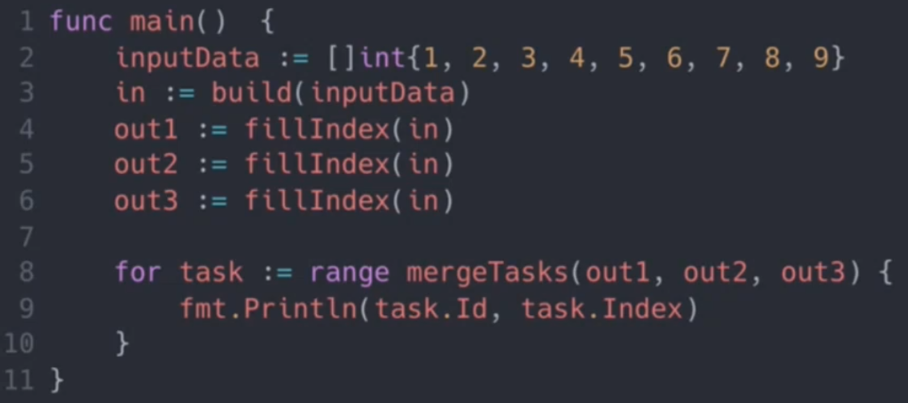**

C Worker Pool

**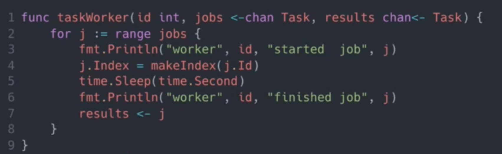**

**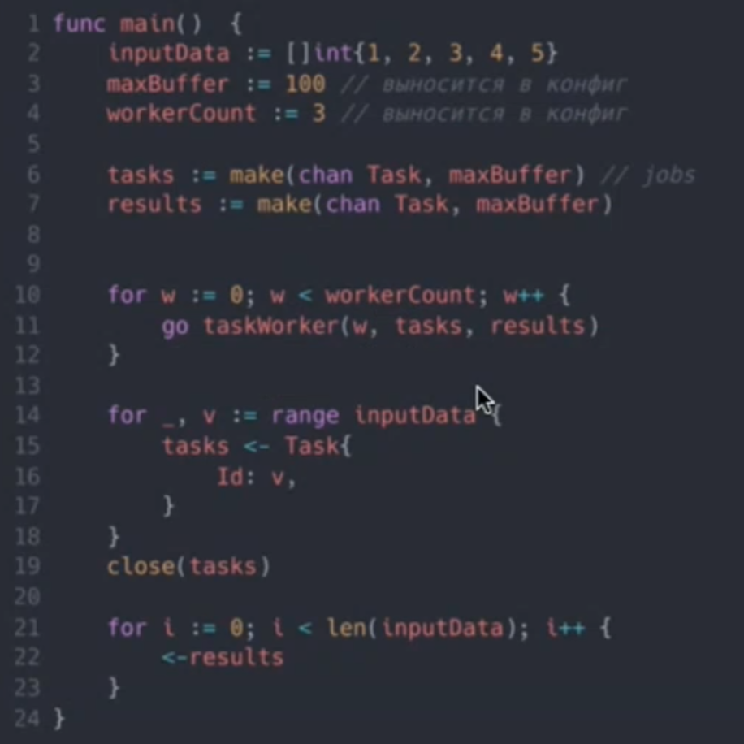**

**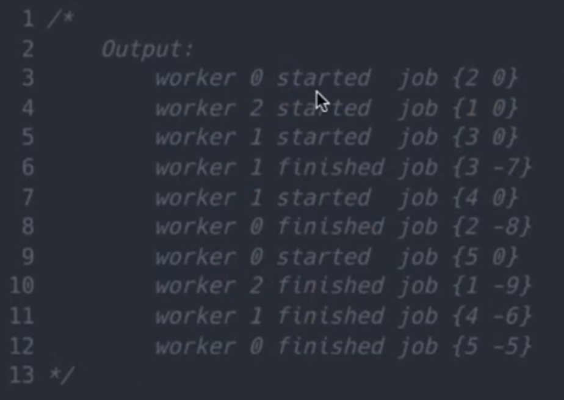**

## Когда использовать?

- Есть большое количество входных данных, которые нужно обрабатывать параллельно
- Алгоритм не разбивается на этапы, этап один \- его и нужно параллелить
- Необходимо управлять количеством воркеров
- Порядок обработки не имеет значения

# 5\. Generator

- отсутствуют встроенные генераторы (yeild)

## Генератор

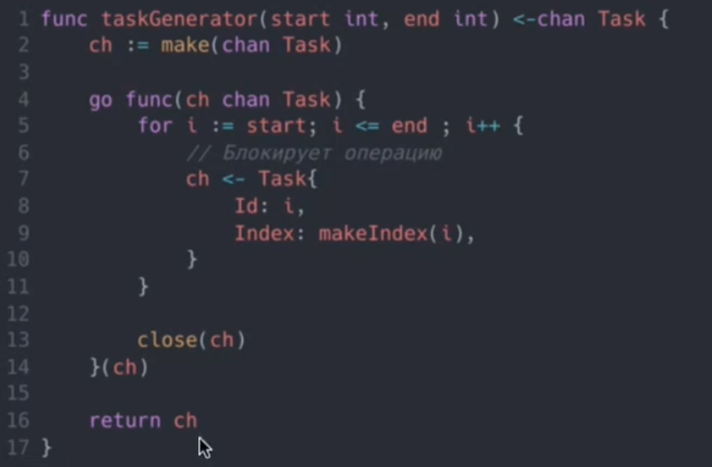 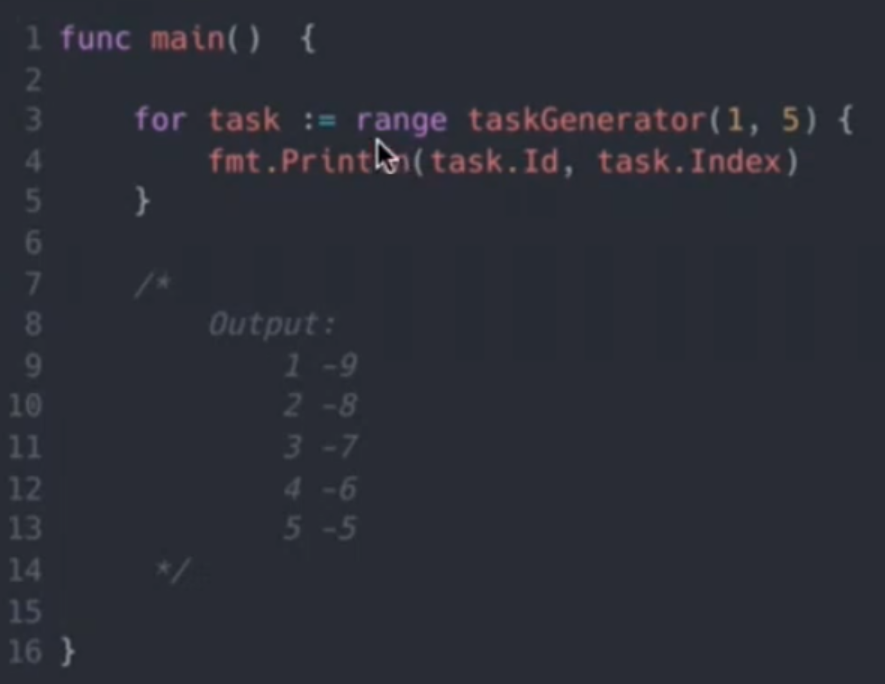

## Когда использовать?

- Требуется генерировать последовательность по запросу
- Важен порядок последовательности
- Нужна блокировка до следующего запроса

# Итоги

1.  Паттерны всем нужны, паттерны всем важны
2.  Pipelines - есть четкие этапы
3.  Fan-in/Fan-out - вдуваем/раздуваем каналы
4.  Worker Pool - управляем воркерами
5.  Generator - yield для Go