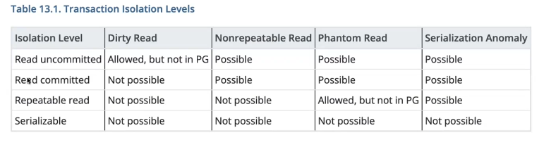
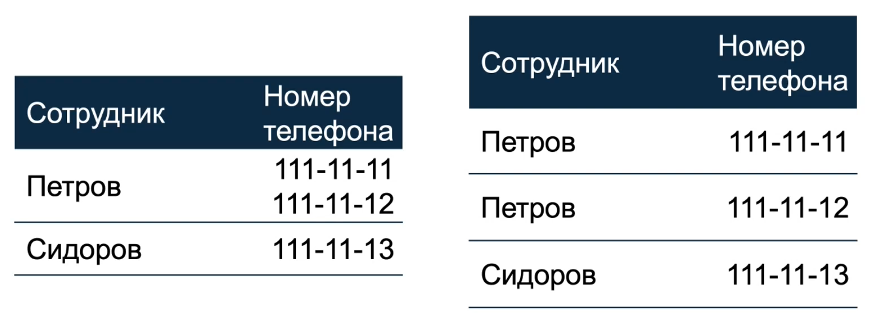
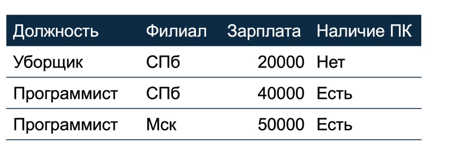
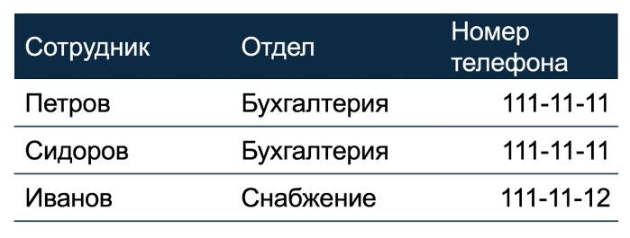
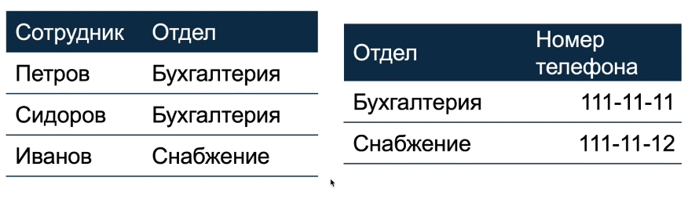
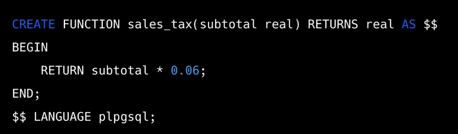
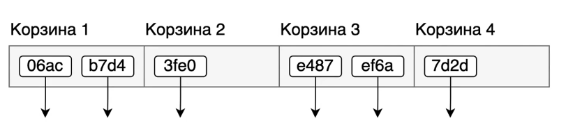
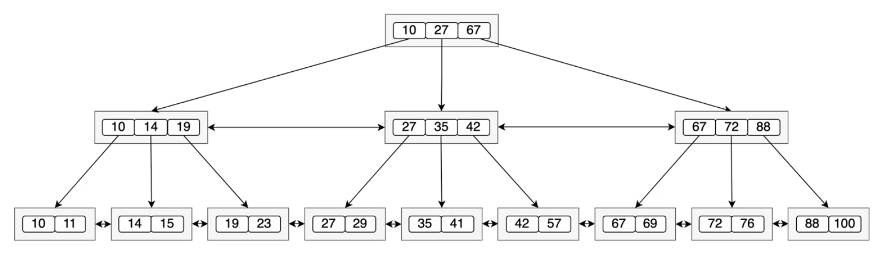
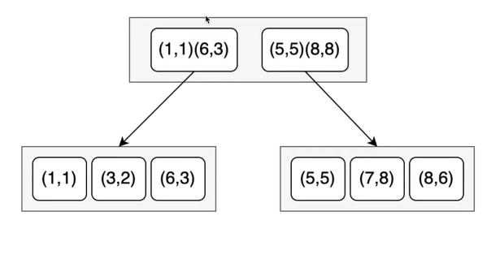

# План занятия

1.  Коротко о PostgreSQL
2.  немного теории СУБД
3.  Та часть PostgreSQL, которая SQL
4.  Индексы и ограничения
5.  Библиотеки для работы с БД

# 1\. Slonik

## PostgreSQL

> Обьектно-реляционная СУБД

### Важные аспекты реляционных БД

- Единый интерфейм \- SQL
- ACID
- целостность данных

### Преимущества PostgreSQL

- Производительность
- Масштабируемость
- Open Source
- Широкий выбор инструментов и расширений

### Клиенты

- psql
- PgAdmin
- VS Code  SQL Tools
- Dbeaver
- DetaGrip

# 2\. Немного теории

## ACID

### Atomacity (атомарность)

> операция либо выполняется полностью, либо не выполняется

### Consistency (согласованность)

> операция не должна ломать согласованность данных (соблюдать ограничения)

### Isolation (изолированность)

> несколько атомарных операций, которые работают параллельно не должны влиять друг на друга

### Durability (надежность)

> если операция проведена, данные сохранены

### Уровни изолированности

### MVCC

По умолчанию уровень изолированности \- RC.

для обеспечения изолированности PostgreSQL реализует *MultiVersion Concurrency Control*

### *1NF*

> *определение*

**

### *2NF*

**

переделываем в:

 

### 3NF

переделываем в:

# 3\. Которко об SQL

### DDL

> разметка данных

- CREATE
- ALTER
- DROP

### DML

> манипуляция данными

- SELECT
- INSERT
- UPDATE
- DELETE

### DCL

> контроль доступа

- GRANT
- REVOKE
- DENY

### TCL

> контроль над транзакциями

- BEGIN
- COMMIT
- ROLLBACK
- SAVEPOINT

## PL/PgSQL

# 4\. Индексы и ограничения

## Типы индексов

- B-Tree
- Hash
- GiST
- SP-GiST
- GIN
- BRIN

По умолчанию команда `CREATE TABLE` создает B-Tree индекс

Для того, чтобы задать тип индекса, явно используется конструкция:

`CREATE INDEX name ON table USING type (column)`

### Hash

- хеш функция возвращает 32битное число - ключ в табличке
- \*корзины \*\- ячейки хеш таблицы
- в корзинах хранятся хеши значений и строки, от которых брался хеш
- подходит для поиска по полному совпадению
- поддерживает оператор *=*

### B-Tree

- подходит для поиска значений в диапазоне и по полному совпадению
- может возвращать отсортированные данные
- можно создавать по нескольким столбцам
- может быть покрывающим
- поддерживает &lt; <=  = \&gt; >=
- сложность поиска *O(log n)*

### Gist

пример 1:

пример 2:

- обьединяет несколько методов индексации
- подходит для поиска по сложным типам данных
- можно создавать по нескольким столбцам
- может быть покрывающим

### SP-GiST

- обьединяет несколько методов индексации
- подходит для поиска несбалансированных данных
- может быть покрывающим

### GIN

- подходит для поиска по составным типам данных
- поддерживает fastupdate
- можно создавать по нескольким столбцам

### BRIN

- обьединяет несколько алгоритмов индексации
- подхожит для поиска в больших таблицах, где значение коррелирует с физическим положением данных в таблице
- неточный индекс, но занимает меньше места в памяти, чем другие индексы
- можно создавать по нескольким столбцам

# 5\. Библиотеки для работы с БД

1:06:30