# План занятия

1.  Логическкое и физическое устройство БД
2.  Обработка запросов
3.  Методы доступа и соединения таблиц
4.  Процессы БД
5.  Костыли

# 1\. Устройство БД

## Логическое устройство

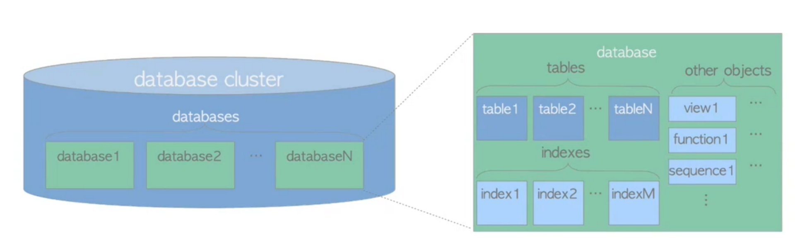

## Физическое устройство

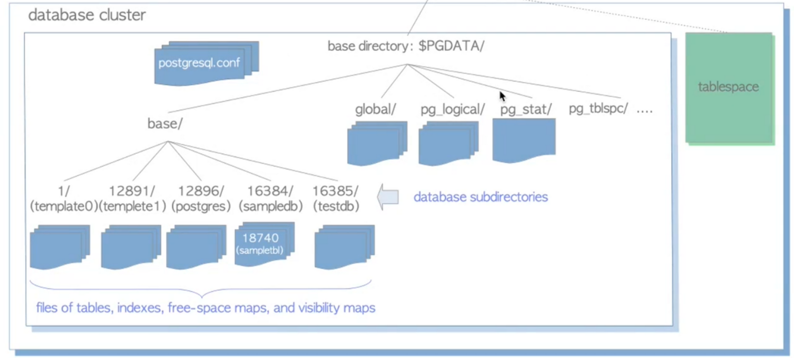

## Табличные пространства

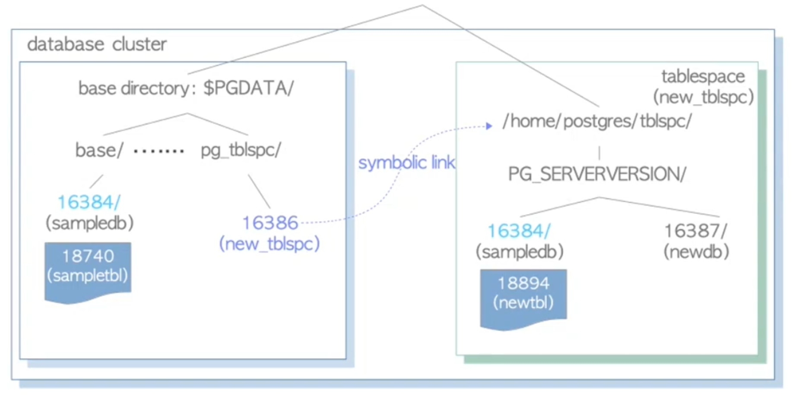

## Устройство heap блока

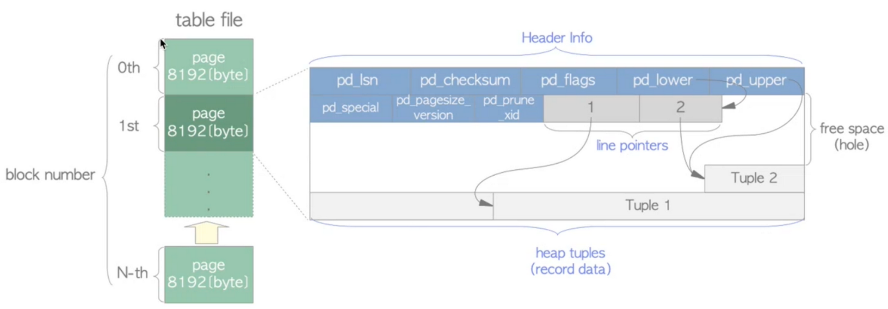

## Жизненный цикл запроса

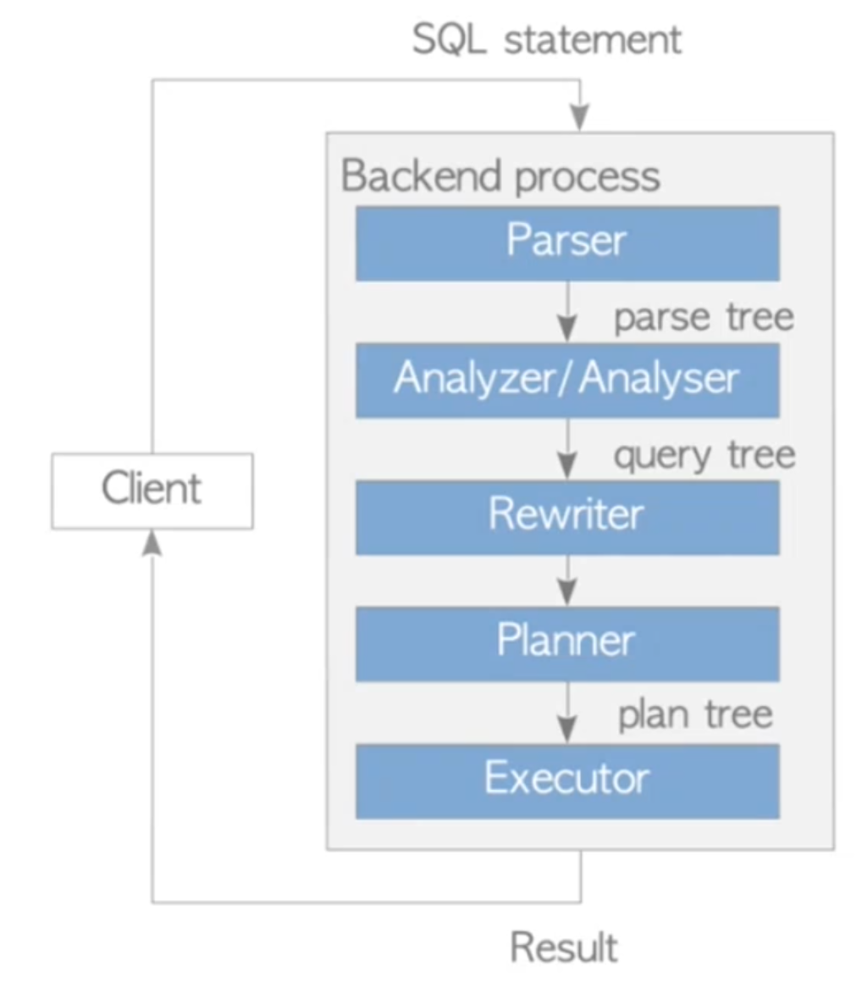

### Parser

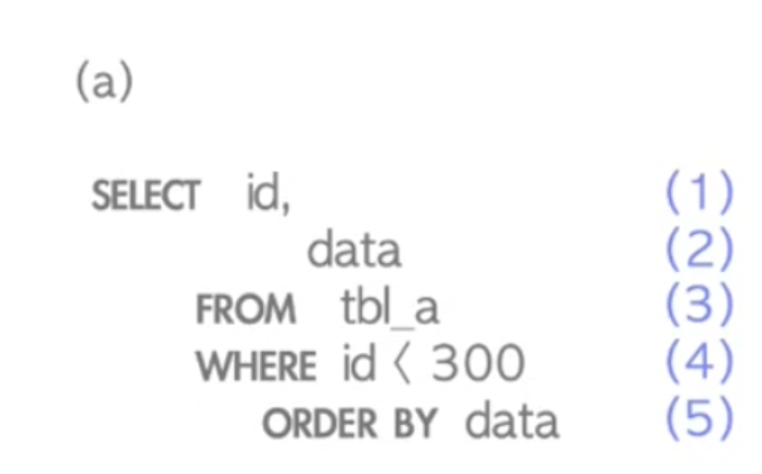 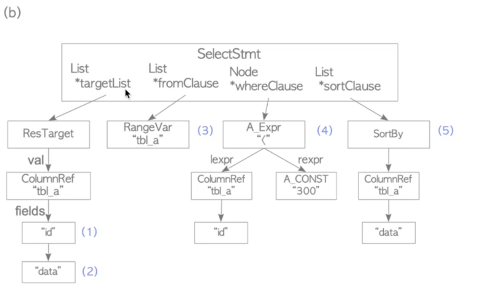

### Analyzer

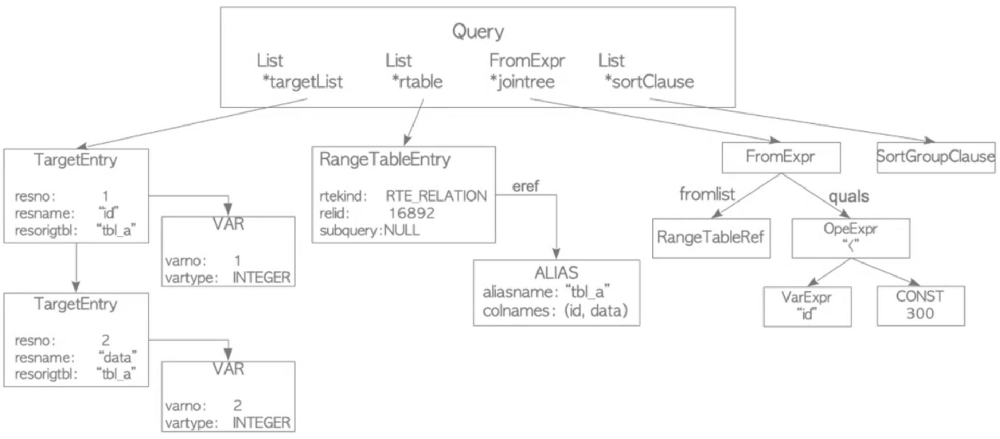

### Rewriter

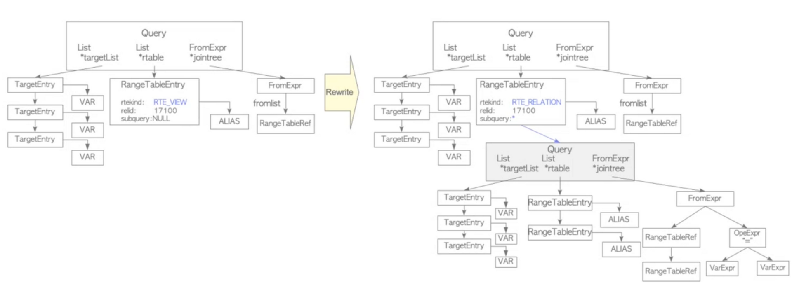

### Planner

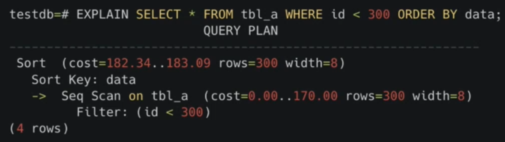Стоимости:

- `seq_page_cost - 1`
- `random_page_cost - 4`
- `cpu_tuple_cost - 0.01`
- `cpu_index_tuple_cost - 0.005`
- `cpu_operator_cost - 0.005`

### Executor

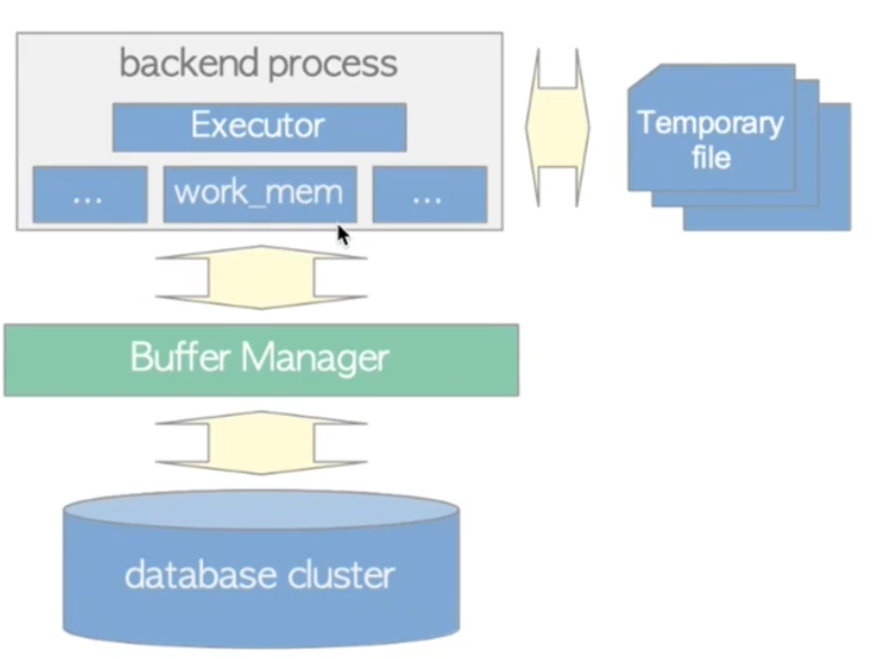

# 3\. Методы доступа и соединения таблиц

## Методы доступа

- Sequental scan
- Index scan
- Index only scan
- Bitmap scan

## Соединения таблиц

### Nested Loop

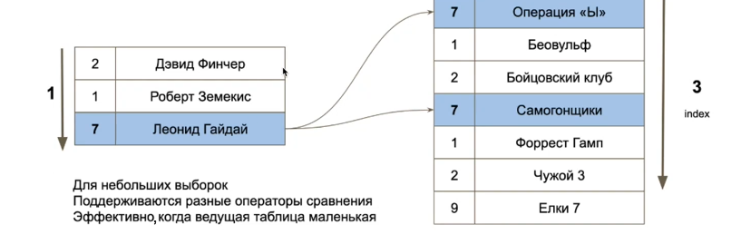

- обычный вложенный цикл
- работает хорошо на небольших наборах данных, особенно для первой таблицы
- не требует подготовки
- поддерживает операции &lt; <= = &gt;= >

### Hash Join

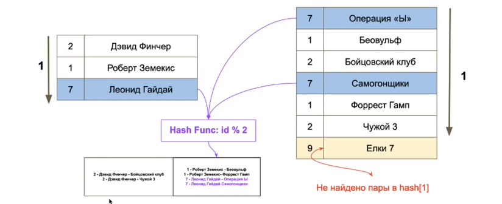

- вычисляется хеш, создается массив хешей от выборок и джойнятся строчки из одной корзинф
- требует подготовки
- поддерживает только операцию =

### Merge Join

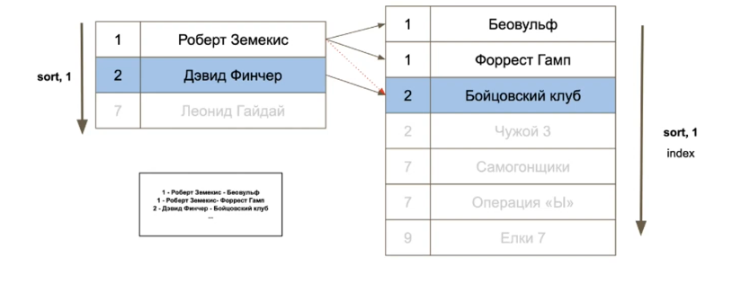

- работает на отсортированных данных
- требует подготовки
- работает быстро
- поддерживает только операцию =

## Тестовые данные

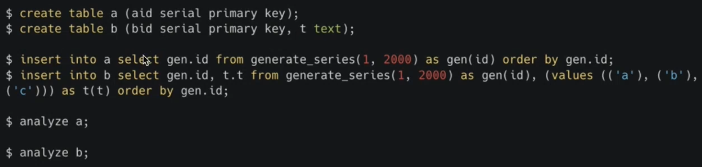

### Nested Loop

### Hash Join

### Merge join

# 4\. Процессы СУБД

## Процессы

## Память

### Shared Buffers

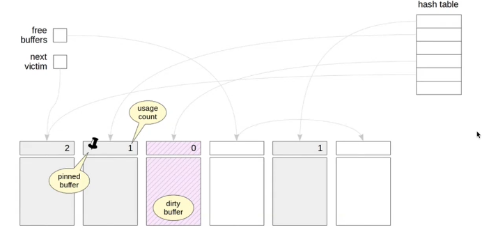

# 5\. Костыли

## Pooler

> мультиплексирует соединения клиентов к меньшему количество соединений к PostgreSQL

### PgBouncer

# Заключение

- Посмотрели внутреннее устройство PG
- Рассмотрели жизненный цикл запроса
- Поговорили о планах запроса и как их читать
- Разобрали процессы PostgreSQL
- Поговорили о недочетах архитектуры Postgres и как их обходить