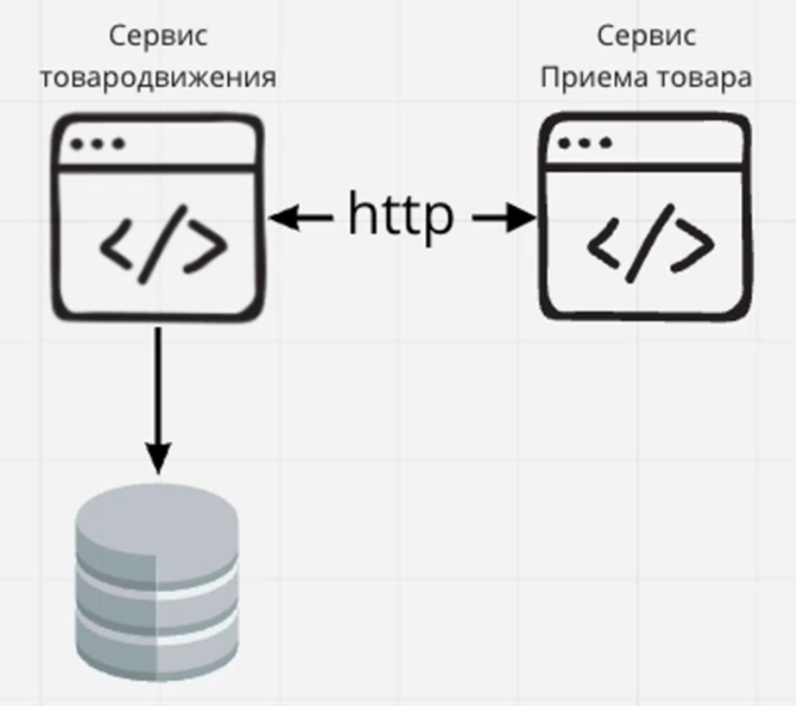
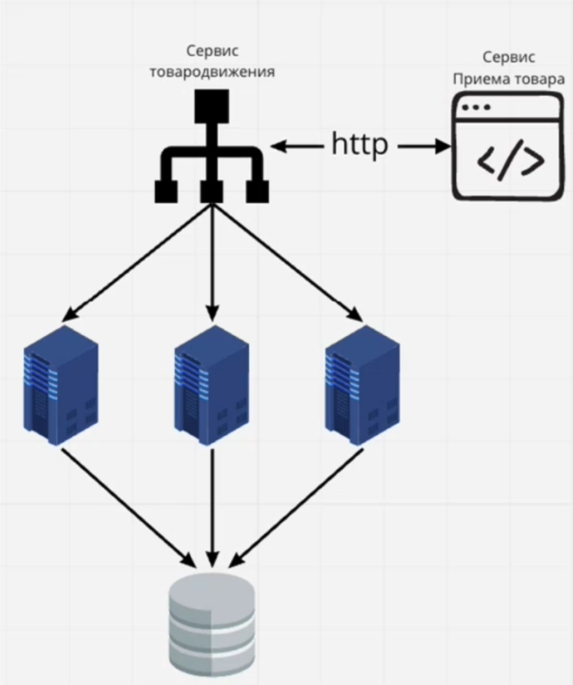

# 1\. Вводная часть

## Характерные черты монолитного подхода

- Избыточность сборок и развертывания
- невозможность масштабирования части приложения
- Увеличение цены сбоя
- Сложность внедрения новых технологий
- Редкость обновлений

## Характерные черты микросервисного подхода

- Простота замены модулей
- Каждый микросервис выполняет только одну задачу
- Независимость программной и аппаратной инфраструктуры модулей
- Приоритет эффективности решений над стандартизацией
- Линейный характер архитектуры

## Клиент-серверное приложение

### Недостатки:

- Сервер \- узкое место в отношении производительности, единая точка отказа
- Изменить принятое решение о размещении функциональных возможностей после создания системы сложно и дорого

## Условный сервис

Сервис и приложение работают в рамках одного компьютера.

Общение с другими сервисами по http в рамках локальной сети.

# 2\. Масштабирование

\*\*scale up \*\*- увеличение "размера" и возможностей по обработке нагрузки

\*\*scale down \*\*- уменьшение "размера" и возможностей по обработке нагрузки

# 3\. Балансировка нагрузки

1.  Купим/арендуем несколько серверов, запустим сервис на каждом из них
2.  Переведем сервис на отдельный сервер
3.  добавим балансировщик нагрузки

## Балансировки нагрузки

*Round robin* \- n-й запрос отправляется на машину с n % num_machines

*Weightet RR* \- хостам назначаются веса с учетом их коэффициента мощности

*Least Connections / Outstanding Requests* \- выбираем машину с наименьшим количеством незавершенных запросов (Connections) и с минимальным числом сетевых подключений.

*Destination Hash Scheduling и Source Hash Scheduling* \- вычисляем хеш от запроса h, отправляем на машину с номером h % num_machines

Sticky sessions - позволяет закреплять сессию за одним сервером или группой серверов.

# 4\. Кэширование

Cache hit & miss - попадание, не попадание в кеш.

Pull -  после получения данных сохраняем результаты в кэш.

Push - сервер отправляет обновление по данным в кеш.

добавим кеширование для сохранения тяжелых вычислений и переиспользования:

- CDN (content delivery network)
- Key Value (in memory database)

# 5\. Репликация

Процесс распространения данных для распределенного хранения.

Репликация данных \- храним одни и те же данные на разных репликах, одна реплика на запись, другие на чтение.

**Сильная согласованность (strong consistency)** \- После завершения обновления любой последующий доступ к данным вернет обновленное значение. 

**Согласованность в конечном счете (Eventual consistency). - **В конечном счете все запросы будут возвращать последнее обновленное значение.

Добавим 2 реплики на чтение к базе данных

- Запросы на чтение направляем к read репликам
- Запросы на запись будут обрабатываться master

# 6\. Шардирование

Разбиение базы данных на относительно независимые части.

- Vertical partitioning: разделение таблицы в несколько таблиц в рамках одного сервера
- Horizontal partitioning / sharding: разбиение таблиц и частей таблиц по нескольким серверам

### Перешардирование (resharding)

shard\_number = id % num\_machines - все номера шардов меняются, если меняется num_machines.

Double inc - если добавляем четное количество, то переносим только половину данных (как на рисунке).

Consistent hashing - переносится разница только на удалении двух точек на кольце.

Добавим шардирование на основе id операции % num_shards

помимо этого шардинг и репликация часто используются совместно.

# 7\. Очереди сообщений

Проблема:

- Дать возможность сервисам обрабатывать запросы, когда они освободятся

Решение:

- Используем очереди сообщений для последовательной асинхронной обработки
- пользователю возвращаем ID задания и даем интерфейс для его проверки
- простое масштабирование

Добавим на схему:

- сервис продюсер для отправки сообщений в очередь
- очередь сообщений
- наши сервисы по мере занятости будут вычитывать сообщения из очереди и обрабатывать

# 8\. SQL и NoSQL

### Когда лучше SQL:

- Имеются логические требования к данным, которые могут быть определены заранее.
- Очень важна целостность данных.
- Нужна основанная на устоявшихся стандартах , используя которую можно рассчитывать на большой опыт разработчиков и техническую поддержку. 

### Когда лучше NoSQL:

- Требования к данным нечеткие, неопределенные или развивающиеся с ростом проекта.
- Цель проекта может корректироваться со временем, при этом важна возможность немедденного начала разработки.
- Одни из основных требований к базе данных \- скорость обработки данных и масштабируемость.