# План занятия

1.  SOLID, DRY, KISS, YAGNI
2.  Архитектурные паттерны
3.  Обзор паттернов проектирования программ
4.  Проектирование распределенных систем

[стать на хабре про solid в Go](https://habr.com/ru/articles/348852/)

# 1\. SOLID, DRY, KISS, YAGNI

## SOLID

|     |     |     |
| --- | --- | --- |
| **Инициал** | **Представляет** | **Название понятие** |
| S   | SRP | *прицип единственной отвественности (single responsibility principle)* Для каждого класса должно быть определено единственное нащначение. Все ресурсы, необходимы для его осуществления, должны быть инкапсулированы в этот класс и подчинены только этой задаче |
| O   | OCP | *Принцип открытости/закрытости (open/closed principle)* программные сущности ... должны быть открыты для расширения, но закрыты для модификации |
| L   | LSP | *Принцип подстановки Лисков (Liskov substitution principle)* Обьекты должны быть заменяемыми на экземпляры их подтиов без изменения правильности выполнения программы |
| I   | ISP | Принцип разделения интерфейса (interface segregation principle) Много интерфейсов, специально предназначенных для клиентов, лучше, чем один интерфейс общего назначения |
| D   | DIP | Принцип инверсии зависимостей (dependency inversion principle) Зависимость на Абстракциях. Нет зависимости на что-то конкретное |

### Принцип единственной ответственности

**Идея: **Каждый обьект должен иметь одну ответственность и эта ответственность должна быть полностью инкапсулирована в класс. Все его поведения  должны быть направлены исключитеSOLID, DRY, KISS, YAGNI  льно на обеспечение этой отSOLID, DRY, KISS, YAGNIветственности.

> A class should have only one reson to change.
> 
> (Robert C. Martin)

1.  В Go один пакет - одна зона ответственности
2.  Если пакет имеет название, которое не говорит о его сути \- скорее всего это плохой пакет
3.  Хорошие имена пакетов
    - net/http, который представляет http клиент и сервер.
    - os/exec, который запускает внешние команды.
    - encoding/json, который реализует кодирование и декодирование документов JSON

### Принцип открытости/закрытости (open-closed principle)

> программные обьекты должны быть открыты для расширения и закрыты для модификации.

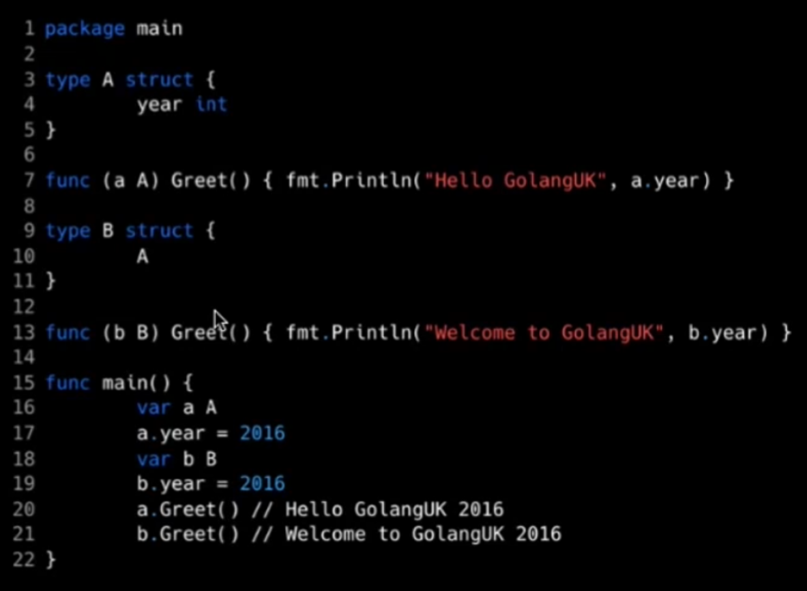

### Принцип подстановки Лисков

> Функции, которые используют базовый тип, должны иметь возможность использовать подтипы базового типа, не зная об этом. *Роберт С. Мартин*

Два типа являются взаимозаменяемыми, если они проявляют такое поведение, при котором вызывающий не может определить разницу.

### Принцип разделения интерфейса

> Клиенты не должны быть вынуждены зависеть от методов, которые они не используют. *Роберт С. Мартин*

На языке Go:

1.  Обьявляем интерфейсы по месту использования
2.  Принимаем интерфейсы, возвращаем структуры (но не увлекаемся)

### Принцип инверсии зависимостей

- Модули верхнего уровня не должны зависеть от модулей нижнего уровня. Оба уровня должны зависеть от абстракций.
- Абстракции не должны зависеть от их деталей. Детали должны зависеть от абстракций
- Граф импора хорошо разработанной Go программы должен быть широким и относительно плоским вместо того, чтобы быть высоким и узким.

## DRY

> Каждая часть знания должна иметь единственное, непротиворечивое и авторитетное представление в рамках системы. Джереми Миллер

Или: в коде не должно быть более одного способа решить задачу

## KISS

Keep it simple, stupid (KISS)

Мы страемся разработать сложную систему специального назначения, используя простые решения на основе сложных систем общего назначения.

- Ozon - сложная система специального назначения
- Микросервис простое решение
- Kafka, postgres - сложные системы общего назначения

## YAGNI

You aren't gonna need it

Реализуем ту функциональность, которая нужна сейчас.

Этому помогают TDD (Test Driven Development) и интерфейсы в Go.

# 2\. Архитектурные паттерны

Поскольку программные продукты становились сложнее, начался поиск общих принципов, которые позволяли бы сделать их проектирование, реализацию и поддержку проще

## MVC

- **Модель **(*Model*) предоставляет данные и реагирует на команжы конроллера, изменяя свое состояние.
- **Представление **(*View*) отвечает за отображение данных модели пользователю, реагируя на изменение модели.
- **Контроллер **(*Controller*) интерпретирует действия пользователя, оповещая модель о необходимости изменений.

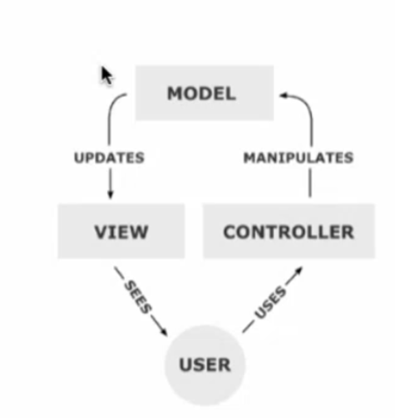

## MVP

- **Модель** *(Model)* \- данные для отображения
- **Вид** *(View)* \- реализует *отображение* данных (из Модели), обращается к Presenter за обновлениями, перенаправляет события от пользователя в Presenter
- **Представитель** *(Presenter) -* реализует взаимодействие между Моделью и Видом и содержит в себе всю логику представления данных о предметной области. При необходимости данные из хранилища преобразует для отображения во View

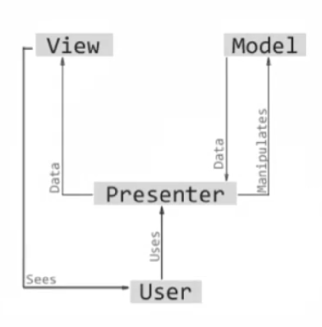

## Чистая архитектура

[статья на хабре](https://habr.com/ru/articles/269589/)

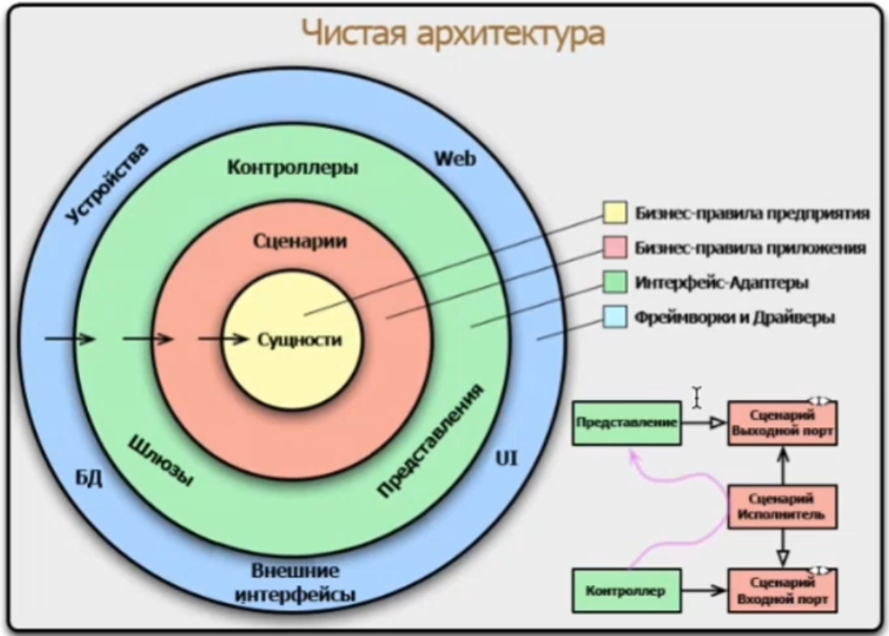

# 3\. Обзор паттернов проектирования программ

## Builder

создание сложных обьектов из простых

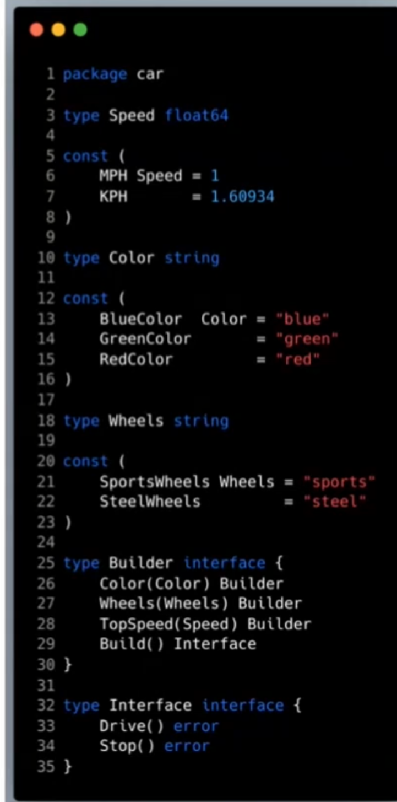

## Singleton

Может быть только один инстанс этой сущности

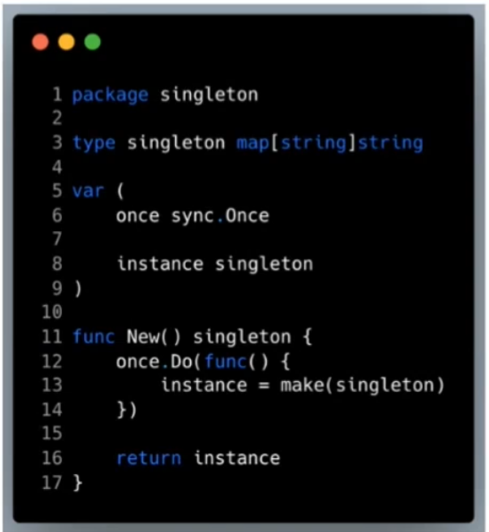

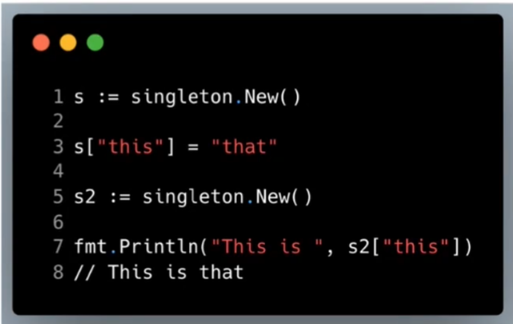

## Proxy

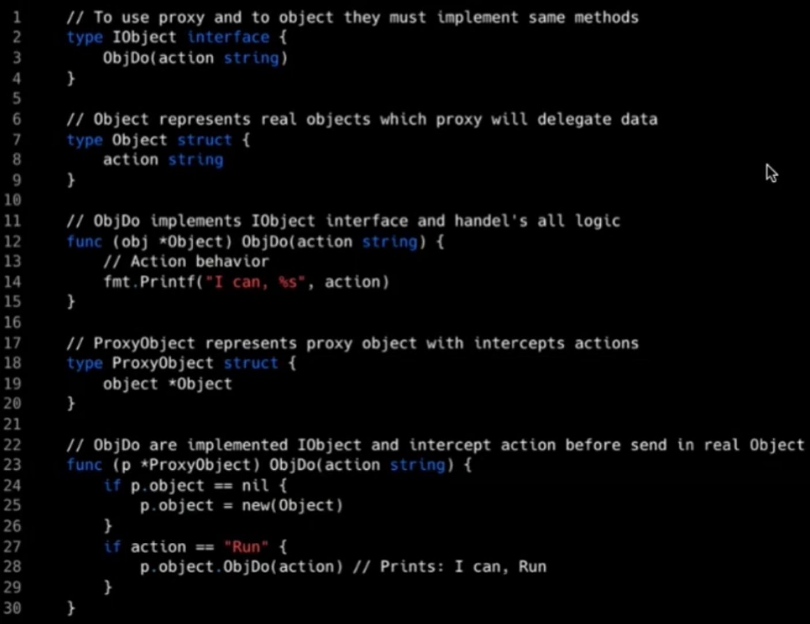

## Семафор

Один код может одновременно выполняться не более N раз

## Генератор

как yield в python

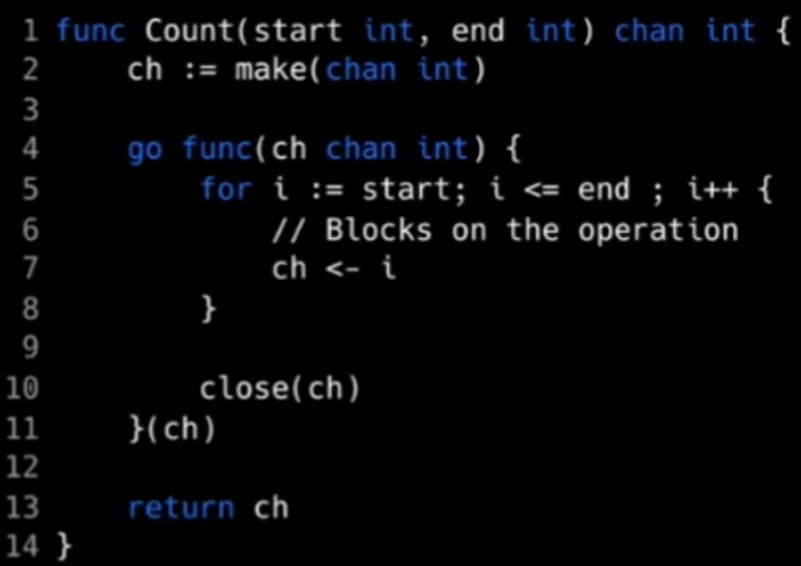

****

****

## TDD **(tast-driven-development)**

разработка через тестирование

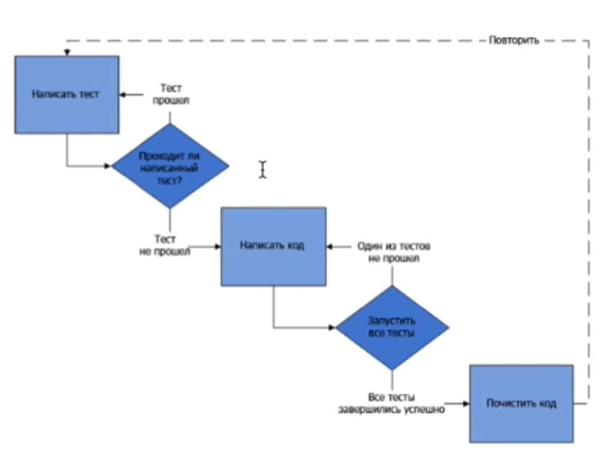

## BDD (behaviour-driven development)

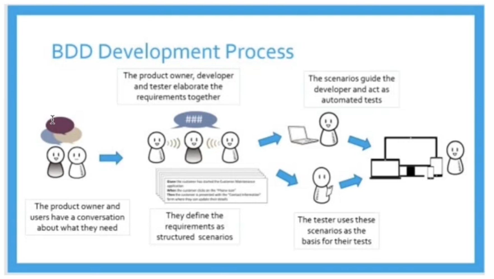